# ATLAS(v2)

## Visualizations

To provide some intuition as to what is happening in the attacks, we provide visualizations for each. Nodes the we identified as root causes are colored red, while nodes that we identified as attack impacts are colored green. Processes that make up the attack chain are colored yellow. We have simplified the graphs for visualization purposes (deduplicated edges, merged nodes with the same label, merged multi-process programs into a single node). Note that these simplifications are for visualization only; the labeling methodology was performed on the raw graph.

### Multihost Attack M1

*Host 1*

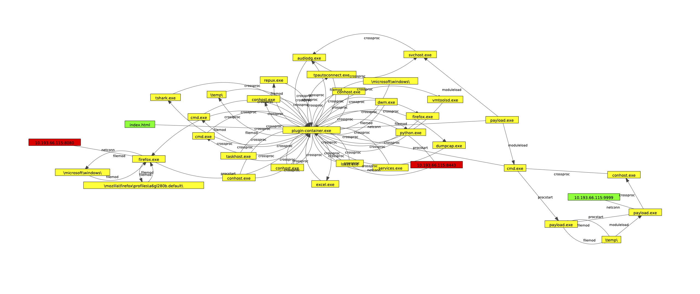

*Host 2*

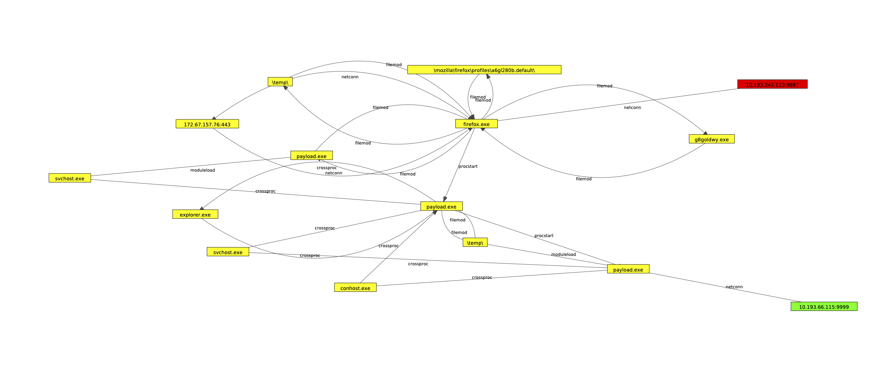

### Multihost Attack M2

*Host 1*

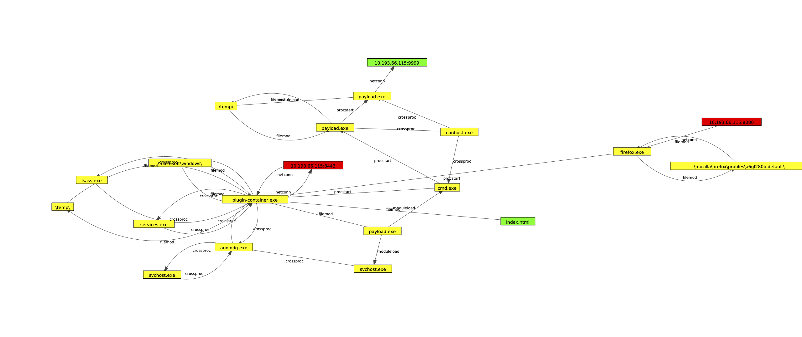

*Host 2*

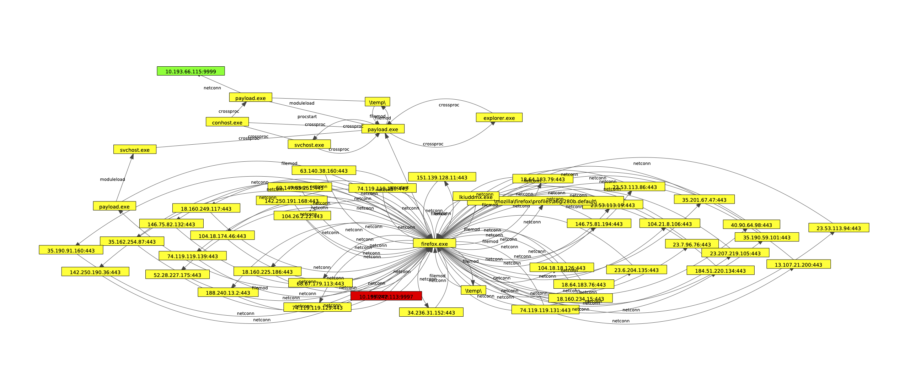

### Multihost Attack M3

*Host 1**

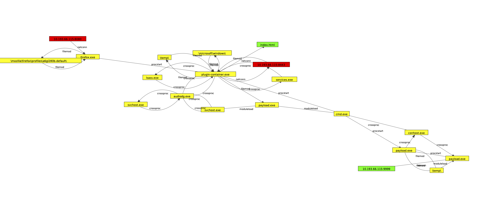

*Host 2*

### Multihost Attack M4

*Host 1*

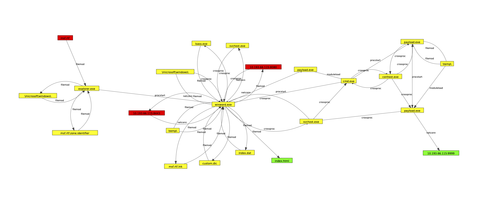

*Host 2*

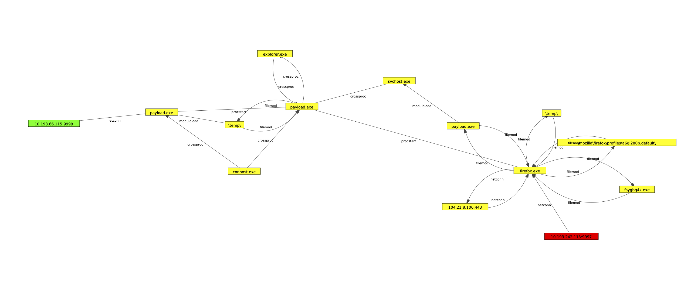

### Multihost Attack M5

*Host 1*

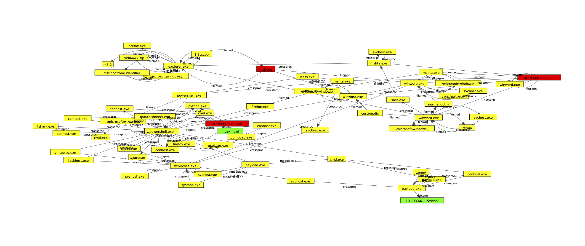

*Host 2*

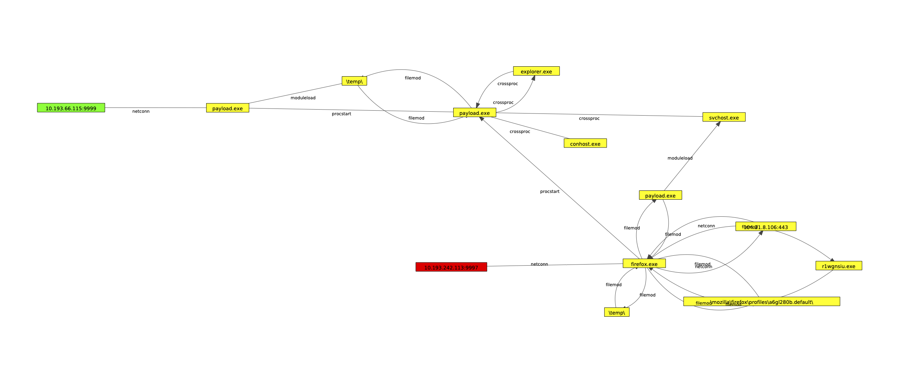

### Multihost Attack M6

*Host 1*

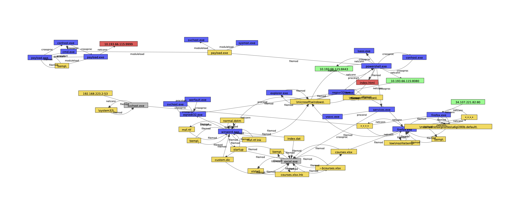

*Host 2*

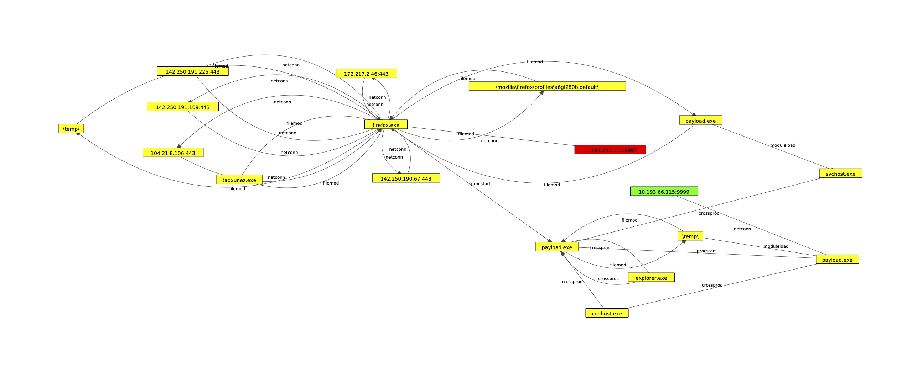

### Singlehost Attack S1

*Host 1*

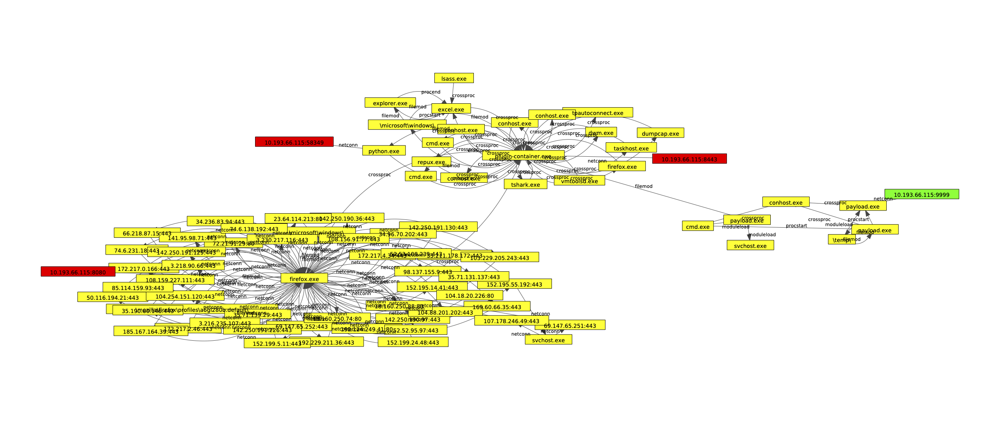

### Singlehost Attack S2

*Host 1*

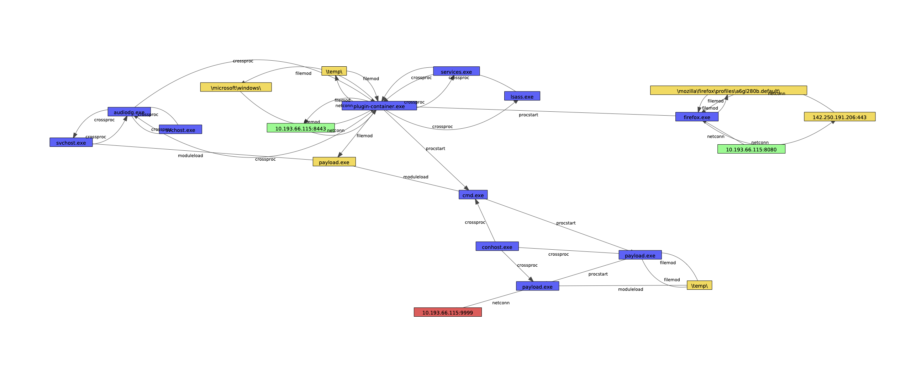

### Singlehost Attack S3

*Host 1*

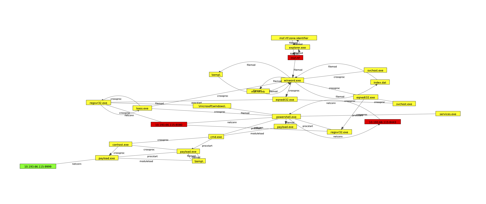

### Singlehost Attack S4

*Host 1*

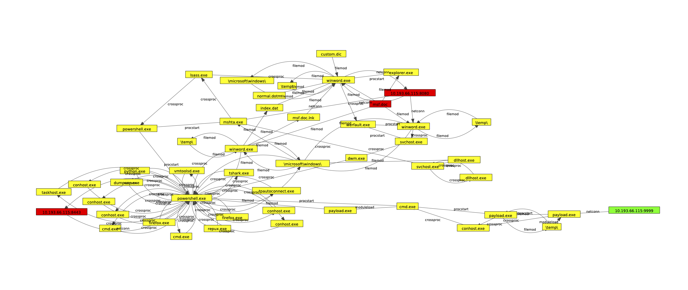
