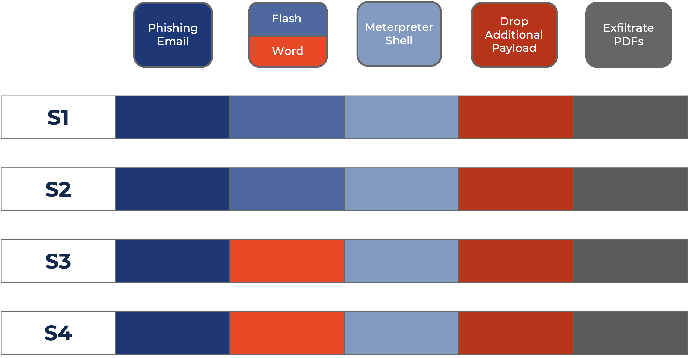
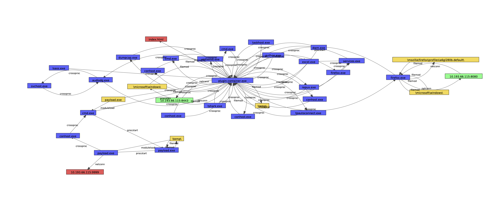
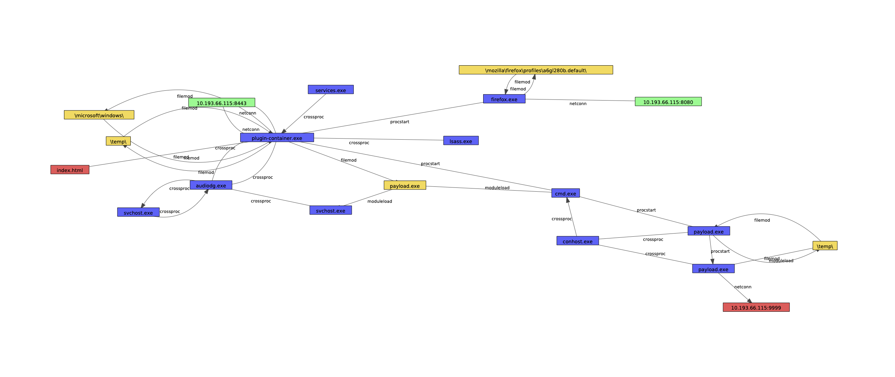
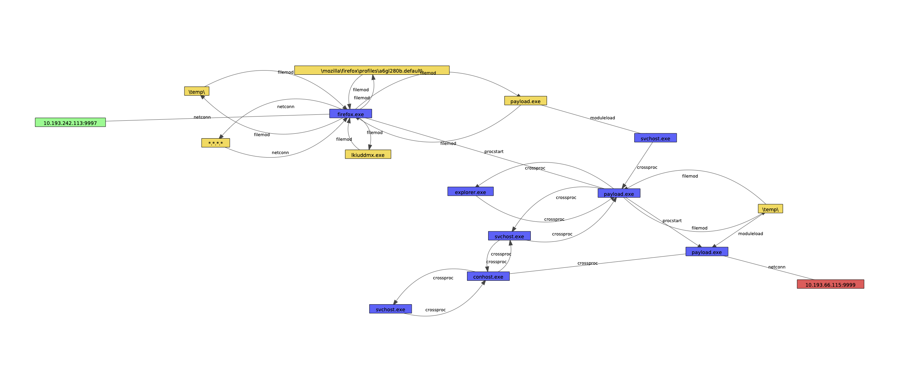
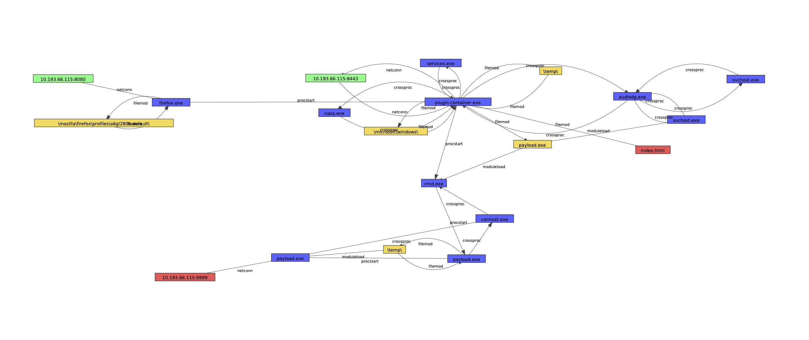
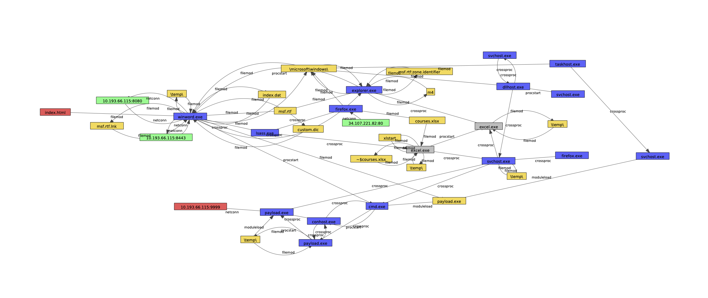
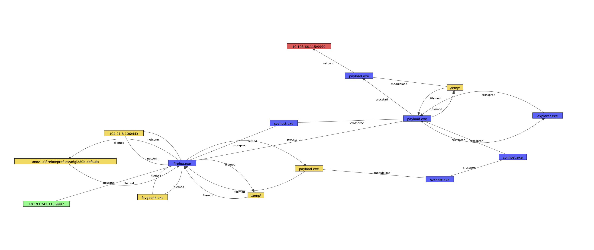
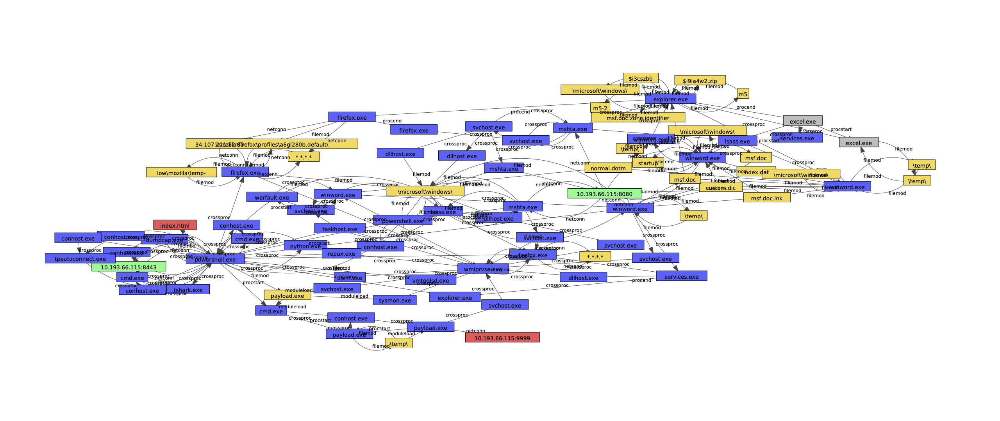

# ATLAS(v2)

Ground truth labels for the ATLASv2 attack engagement.

## Using ATLASv2

While there are ten attacks in ATLASv2, *all attacks are highly redundant,* creating the potential for the dataset to be used incorrectly in anomaly detection tasks. Training on any of the attack data is equivalent to training on test data, as shown below:

We have provided the attack procedures from the original ATLAS dataset in the attack_descriptions folder. Attacks S1 - S4 are comprised of the following steps:

In Step 2, S1 and S2 use a Word vulnerability while S3 and S4 use a flash vulnerability instead. This means that, for each attack, three other attacks are highly similar (4 of 5 steps are the same) and one attack is nearly identical (same attack vector in step 2):

Attacks M1-M6 are continuations of S1-S4 that spread to a second machine. Here are the new steps introduced to the singlehost procedure:

Like the singlehost attacks, the multihost attacks only meaningfully vary in step two, with 7 of 8 highly similar steps in the attack chain:

## Visualizations

To provide some intuition as to what is happening in the attacks, we provide visualizations for each. Nodes the we identified as root causes are colored red, while nodes that we identified as attack impacts are colored green. Processes that make up the attack chain are colored yellow. We have simplified the graphs for visualization purposes (deduplicated edges, merged nodes with the same label, merged multi-process programs into a single node). Note that these simplifications are for visualization only; the labeling methodology was performed on the raw graph.

### Multihost Attack M1

*Host 1*

*Host 2*

Note that one remote host (the IP address shaded in yellow) is wrongfully implicated in this attack.  This is a result of the background activities conducted by a second experimenter during the attack engagement. It does not effect the processes identified in the attack chain.

### Multihost Attack M2

*Host 1*

*Host 2*

Note that many remote hosts (the IP addresses shaded in yellow) are wrongfully implicated in this attack.  This is a result of the background activities conducted by a second experimenter during the attack engagement. It does not effect the processes identified in the attack chain.

### Multihost Attack M3

*Host 1**

*Host 2*

Note that two remote hosts (the IP addresses shaded in yellow) are wrongfully implicated in this attack.  This is a result of the background activities conducted by a second experimenter during the attack engagement. It does not effect the processes identified in the attack chain.

### Multihost Attack M4

*Host 1*

*Host 2*

Note that one remote host (the IP address shaded in yellow) is wrongfully implicated in this attack.  This is a result of the background activities conducted by a second experimenter during the attack engagement. It does not effect the processes identified in the attack chain.

### Multihost Attack M5

*Host 1*

*Host 2*

Note that one remote host (the IP address shaded in yellow) is wrongfully implicated in this attack.  This is a result of the background activities conducted by a second experimenter during the attack engagement. It does not effect the processes identified in the attack chain.

### Multihost Attack M6

*Host 1*

*Host 2*

Note that five remote hosts (the IP addresses shaded in yellow) are wrongfully implicated in this attack.  This is a result of the background activities conducted by a second experimenter during the attack engagement. It does not effect the processes identified in the attack chain.

### Singlehost Attack S1

*Host 1*

### Singlehost Attack S2

*Host 1*

### Singlehost Attack S3

*Host 1*

### Singlehost Attack S4

*Host 1*

