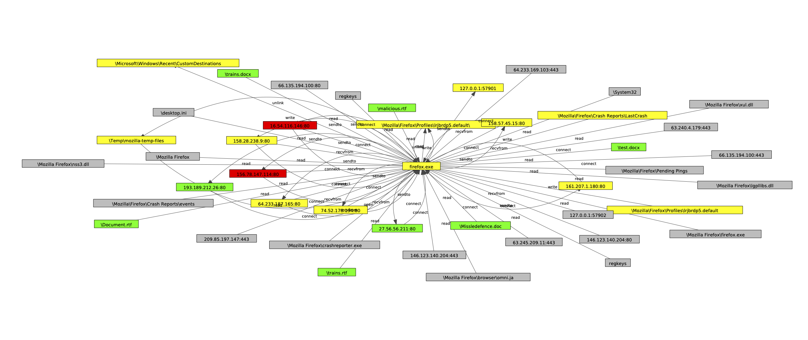
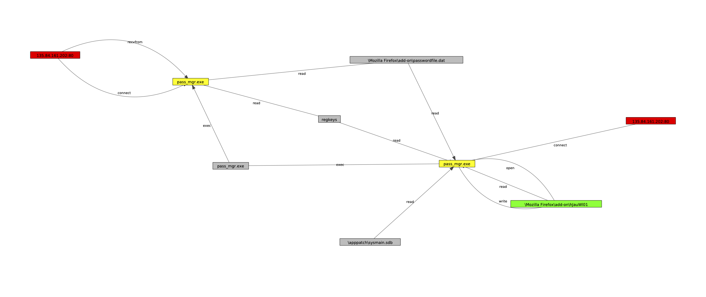
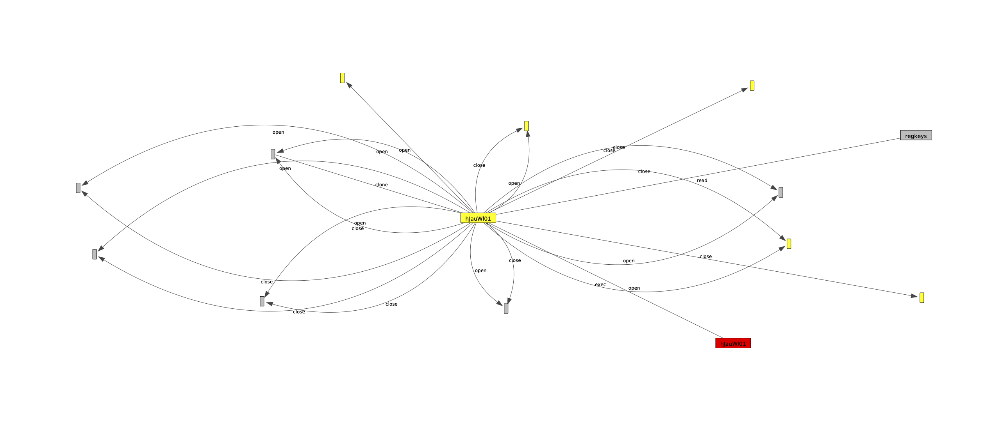

# DARPA TC Engagement 3

We provide labels for all processes that are *malicious* (label=attack) or *contaminated* by the attack (label=contaminated). 

We provide labels for all processes that are *malicious* (label=attack) or *contaminated* by the attack (label=contaminated). All other processes in the dataset are benign. The ground truth document, [available with the dataset](https://github.com/darpa-i2o/Transparent-Computing/blob/master/README-E3.md), contains additional information about each attack. We provide labels for the "Nation State" attacks, but not the "Common Threat" attacks because many of the common threat attacks are indistinguishable from normal user activity in the log files.

Each attack attempt is assigned a label according to the section number in the ground truth document. Several of the attack attempts took multiple tries to succeed, so we further divide the attack attempts into *success* and *fail* states. We do not recommend testing against the failed attack attempts because, like the common threats, they typically did not lead to a meaningful attack footprint on the target machines.

## Visualizations

To provide some intuition as to what is happening in the attacks, we provide visualizations for each. Nodes the we identified as root causes are colored red, while nodes that we identified as attack impacts are colored green. Processes that make up the attack chain are colored yellow. We have simplified the graphs for visualization purposes (deduplicated edges, merged nodes with the same label, merged multi-process programs into a single node). Thus, there are many more attack processes in the label set than appear in the visualization.

### 3.3 2018-04-10 1400 THEIA – Firefox Backdoor w/ Drakon In-Memory

*FAIL: First attempt via allstate.com ad*

*FAIL: Second attempt via gatech.edu ad*

*SUCCESS: Third attempt on later connection to gatech.edu*

### 3.4 2018-04-11 1000 FiveDirections – Firefox Backdoor w/ Drakon In-Memory

*SUCCESS: Firefox exploit via www.cnpc.com.cn ad*

### 3.10 2018-04-12 1100 FiveDirections – Browser Extension w/ Drakon Dropper

The continued attack on FiveDirections did not go well for the red team. They were unable to load dragon into memory on their first attempt, and then later failed to execute it successfully even when it was written to disk. We're going to cause stage one of the attack (`pass_mgr.exe`) a success because the attacker left a meaningful footprint on the machine. The second stage of the attack (`hJauWl01`) does not leave a meaningful footprint so we designate it as a failure.

*SUCCESS: Execute malicious password manager and connect to shellcode server, fail to load drakon dropper to memory, write drakon to disk as hJauWl01.*

*FAIL: Attempt to execute drakon from disk*

### 3.11 2018-04-12 THEIA – Browser Extension w/ Drakon Dropper

*FAIL: Memory injection attempt to SSHD did not work*

*SUCCESS: Micro APT written to disk instead*

## Other Notes

### Missing Data

The E3 dataset suffer from missing vertex labels to varying extents. The primary cause for this appears to be key system calls that audit frameworks missed because they weren't turned on yet. For example, if a file is `opened` before capture begins but `read` afterwards, the framework is aware that a data entity is accessed but can no longer recover the filename. The same is true for programs that were `exec`'d before capture started; the PID is referenced but the executable name is lost. If an unlabeled process appears in the attack path it is always marked as *contaminated,* not attack, as it is not possible to verify using the ground truth.

### Timing information

Note that the ground truth reports timestamps which are very useful for
correlating events in the provenance graph. These timestamps are unmarked; by
inference (since Kudu Dynamics is based in Maryland and the dataset was
collected in April) and some validation checking, we found the correct
timezone to be EDT, i.e., UTC-4.

## Why not ClearScope?
We don't include any labeling for ClearScope because the timestamps of
ClearScope seem to be in arbitrary units (e.g., like a monotonic system
clock). This makes it difficult to verify events based on their timestamps, so
we ignore ClearScope for now.

## TRACE notes
We focus on the 3 Nation State TRACE attacks. Note that unlike THEIA, TRACE
had execution partitioning using BEEP. This specifically shows up in the
attack logs, as firefox was execution-partitioned and so many of its behaviors
are attributed to execution units, not to an overall firefox process.

An important note for the TRACE provenance graph: TRACE's usage of CDM events
seems to differ the most from other datasets: there are instances of `exec`
events between two processes (as opposed to a process and file), which doesn't
actually make sense based on the UNIX `exec` semantics; these should be clones
instead (or perhaps they represent versioning, which does make sense, but in
that case there should also be some reference to the executed program binary).
Additionally, there are `loadlibrary` events that seem to fit the role of UNIX
`exec` calls; e.g., a `wget` process has a `loadlibrary` call referencing the
`wget` binary. We have verified that TRACE is the only dataset of the four
surveyed here that uses `exec` in this way.

### 3.2: Firefox Backdoor
Like THEIA, TRACE attacks also had many failed attempts. Rather than creating
a separate subgraph for each failed attempt, we collected them all into one.
The report mentions that errors caused TRACE to lock up, which resulted in
lost logs and a massive spike in activity. From the provenance graph, we once
again don't see any evidence of the malicious server (`145.199.103.57:80`),
but we do see the shellcode server. Therefore, many of the reported
connections from 10:22 to 10:40 are not visible.

Additionally, the massive spike in activity for the failed attacks is evident.
The first attack just appears as a single isolated process with a massive
flurry (~9 million events) of network I/O activity that is probably related to
the observed server unresponsiveness. The second failure is much smaller and
also has a single firefox process with no other activity.

The logs reference `/home/admin/cache`, which does appear in the logs,
`/dev/glx_alsa_675`, which does appear in the logs, and `/var/log/xtmp`, which
does not. We were able to find a parent of `cache` with some unknown name, but
hit a dead end from that point (and the parent appears to have UNIX timestamp
0). Similarly, we were able to find when the firefox event unit writes to
`/dev/glx_alsa_675`, but couldn't find an apparent link to `cache`. Therefore,
these two portions of the attack subgraph appear disconnected, though there is
logically some edge (either not handled by our provenance graph or not
captured correctly) that should connect these attack steps together.

### 3.12: Firefox Extension
The ground truth indicates this attack failed. The two referenced addresses
are not in the logs. However, the shellcode server seen in 3.2 does actually
appear at the referenced time (04/12 13:36), and from it, we do see the
malicious `pass_mgr` extension. Once again, we see evidence of the mass events
that are related to the server being unresponsive (~240 million events!)

### 3.15: "Pine Backdoor"
Not exactly sure why this is called pine backdoor, as it actually traces to
the Firefox browser extension --- the ground truth doesn't even mention pine
until the provenance graph. In fact, the pine attack involving tcexec seems to
be a different attack entirely (one of the common threat phishing attacks).

From examining the logs, this attack is actually started by `pass_mgr` at
04/13 12:43, which creates `gtcache` via `sh`. `gtcache` then creates `ztmp`
in the same manner. (We initially believed these processes were all detached,
but realized that they are connected by `exec` events between two processes,
instead of the `clone` events we expected to see.)

## CADETS notes
CADETS is a FreeBSD host and appears to have worse log capture than the Linux
and Windows hosts. For example, many key processes such as `nginx` are
actually missing process name information, although we can infer that they are
`nginx` based on their behavior (e.g., writing to an `nginx` access log). For
some processes we can also infer the name from `exec` events, although this is
not always possible.

### 3.1: nginx Backdoor
The ground truth indicates CADETS crashed during this attack. It refers to a
file `/var/log/devc` that doesn't appear anywhere in the logs --- the logs
were probably lost due to the crash. We are able to see evidence of `nginx`
communicating with the shellcode server and the other malicious processes,
`/tmp/vUgefal`. Since `nginx` is a long-running process, we need to be careful
when constructing the attack subgraph not to include all of its edges.

The provenance for `vUgefal` is actually unclear: it is forked by a process
with a missing timestamp that exhibits a lot of different behaviors, and it is
long-running. Since we were unable to figure this out, we settle for just
including `vUgefal` and the attack portions of `nginx` in the subgraph.

### 3.8: nginx Backdoor 2
Based on the ground truth, this is essentially just repeating Section 3.1,
even with the same result of crashing CADETS at the end. This time, we don't
see any evidence of the reported malware (`/tmp/grain`), so we can only
reconstruct the communication with nginx.

### 3.13: nginx Backdoor 3
Once again, this is like Section 3.1. We still have malware processes that
seem disconnected from `nginx` although there are many more. Notably, the
final `test` process seems to have a lot more activity than previous attacks.

### 3.14: nginx Backdoor 4
Same deal as before - once again, many of the referenced files (e.g.,
`eWq10bVcx`, `memhelp.so`, `eraseme`, and `done.so` don't appear in the logs).